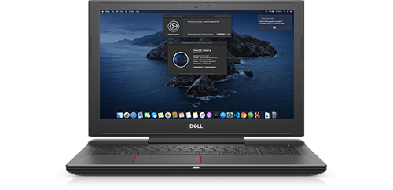
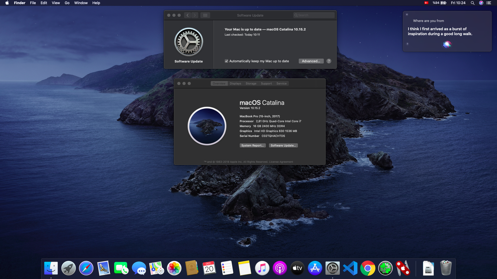

# Hackintosh for DELL Inspiron 7577

    

## Index
* [System Information](#system-information)
    + [Hardware](#hardware)
    + [Software](#software)
    + [BIOS Options](#bios-options)
* [Working](#working)
* [Not Working](#not-working)
* [Download](#download)

## <a name="system-information">System Information</a>
### <a name="hardware">Hardware</a>
* **CPU:** *Intel Core i7-7700HQ (Kaby Lake)*
* **GPU:** *Intel HD Graphics 630 + Nvidia GTX 1050Ti*
* **RAM:** *16 GB DDR4 2400 MHz (Single Module)*
* **SSD:** *Lite-on 128 GB M.2 SATA*
* **Wi-Fi** *Intel Dual Band Wireless-AC 8265*
* **Ethernet** *Realtek RTL8111*
* **Audio** *Realtek ALC3246*
* **Display** *15.6" 1080p IPS (Internal)*
* **2nd Display** *23.5" Samsung CF396 (HDMI)*

### <a name="software">Software</a>
* **OS:** *MacOS Catalina 15.2*
* **Bootloader:** *Clover v2.5k-5101*
> I'm installing to SSD for greater speed. You can also use HDD instead of SSD.

### <a name="bios-options">BIOS Options</a>
> *Just change **"SATA Mode"** to AHCI and disable **"Secure Boot"***. I just changed these and works well on my computer. I think no more disabling **"Virtualization Technology"** is needed.

## <a name="working">Working</a>
* LCD Backlight Adjusting
* Volume and Volume Adjusting
* Touchpad and Gestures
* Wired connection
* Fn Keys
* Microphone
* Camera
* USB Ports
* HDMI
* Battery Percentage
* Sleep Mode (Also working with closing the lid.)
* System Updating
* Mounting EFI Directory
* Siri
* AppStore

## <a name="not-working">Not Working</a>
* Internal Wi-Fi and Bluetooth Module
* Nvidia GTX 1050Ti GPU
* USB Type-C Port (Accually haven't tried it)
* Internal SD Card Reader
* Internal Fingerprint Sensor
* Audio Jack (Unexceptable level noisy sounds)
* Caps Lock Light  

## <a name="download">Download</a>
> You can download my EFI folder and start MacOS Catalina with it. Just change your EFI folder with mine: [Go to releases section.](https://github.com/berkoca/Hackintosh-Dell-7577/releases)

#### Catalina Main Screen

    

